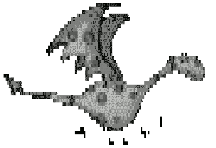

EDIT: There is also much more interesting and 2013 [multimarkdown][1] which is targeted at more than just html. (untested)

Markdown example:

<pre># Glavni naslov 

## En link 

[an example](http://example.com/ "Title") inline link. 
[This link](http://example.net/) has no title attribute. 

## Avtomatski link 

&lt;http://brontosaurusrex.mooo.com&gt; 

## Ena slikca 

 

&gt; To je pa tak citat 

## In malo kode 

    ena html koda 
    tleke /\ 
    pa tleke 

## Se ne podnaslov 
Se malo tlele pise. 
</pre>

Minimal html5 seems to be;

    <!DOCTYPE HTML>
    <html>
    <head>
    <meta charset="UTF-8">
    <title>Title of the document</title>
    </head>
    <body>
    
    ...
    
    </body>
    </html>

 [1]: http://fletcherpenney.net/multimarkdown/